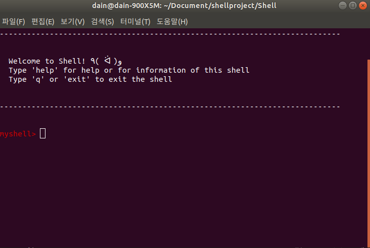

 # Shell
 A Simple Shell written in C. Project for System Programming 2019

## Screenshot
 


## Features
- Delimiters: pipe(|), redirection(>, <)
- Built-in commands : exit, cd, hi, help, builtin, history
- commands with execvp()

## Installation
1. Clone the repo
```
$ git clone https://github.com/promisemee/Shell
```
2. Run make
```
$ make
```
3. Execute!
```
$ ./shell
```
## Wiki
- [Shell Wiki!](https://github.com/promisemee/Shell/wiki)

## License

- [MIT License](https://github.com/promisemee/Shell/blob/master/LICENSE)
